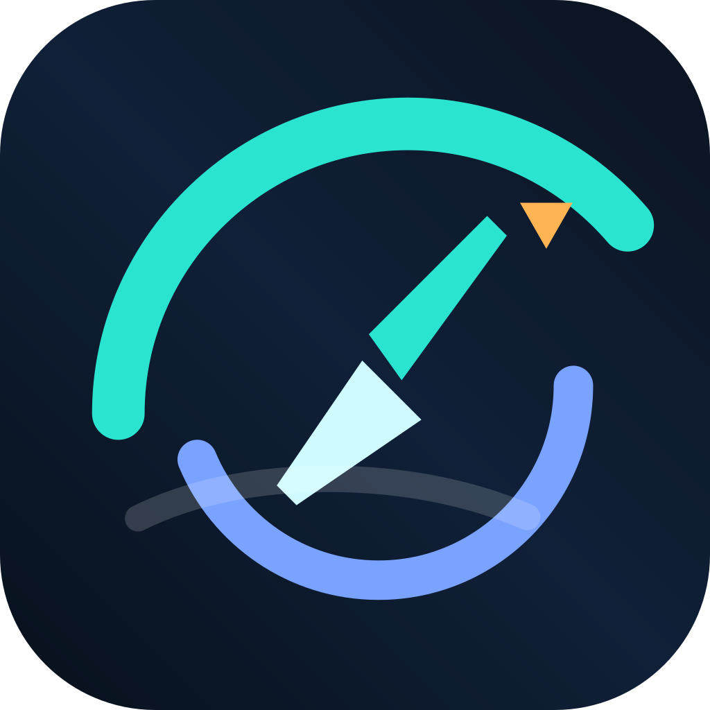

# Vesta NG Cluster

<p align="center">
  
</p>

<p align="center">
  <a href="https://github.com/foric27/VestaNGCluster/actions/workflows/android-release.yml">
    
  </a>
  <a href="https://github.com/foric27/VestaNGCluster/releases">
    
  </a>
  <a href="LICENSE">
    
  </a>
</p>

**Vesta NG Cluster** - Android-приложение для вывода навигации и мультимедиа на цифровую комбинацию приборов Lada Vesta NG через нештатную Android-магнитолу.

Целевые устройства: **Teyes CC3, CC3 2K** и другие Android-магнитолы со схожей root-средой.

**Важно:** такие магнитолы не умеют нативно выводить UI на cluster display. Для основного streaming-потока требуется **root-доступ**: он нужен для настройки USB/RNDIS-сети, policy routing, root-launch на secondary display и поддержания транспортного канала до комбинации приборов.

## Что делает проект

Приложение поднимает отдельный foreground-сервис, готовит root-сеть до цифровой приборки, запускает целевую activity на secondary display, снимает кадры с `VirtualDisplay`, кодирует их в H.264 и отправляет на комбинацию приборов по UDP.

Для мультимедиа приложение не отправляет "чистые метаданные" отдельным каналом. Вместо этого оно собирает данные из media notifications и `MediaSession`, отрисовывает собственный MED-экран (`MediaCoverActivity`) и отправляет его в тот же video pipeline, что и навигацию.

## Возможности

- **Вывод навигации (NAVI)** - трансляция интерфейса навигационного приложения на cluster display.
- **Вывод мультимедиа (MED)** - отрисовка обложки, названия, артиста и прогресса на cluster display.
- **Режим ABS/TRIP** - отдельный stream mode для комбинации приборов.
- **Foreground-сервис трансляции** - единый runtime-оркестратор для сети, видео, статуса, recovery и обновлений.
- **H.264 видеокодирование** - аппаратное кодирование через `MediaCodec`.
- **UDP-транспорт** - отдельный video path и отдельный status-sync path.
- **Root-сеть** - auto/manual выбор USB-интерфейса, статический IP, route, policy routing и `iptables` mark.
- **Startup probes и watchdog** - проверка готовности UDP-маршрута и runtime-контроль линка/маршрута.
- **Встроенный FTP-сервер** - выдача `ICUpdate.zip` для IVI/cluster OTA-сценария.
- **Self-update приложения** - проверка, скачивание и установка новой APK из GitHub Releases.
- **Runtime-конфигурация** - скрытый developer screen с настройками без пересборки.
- **Recovery-сценарии** - restart/backoff, task-removed recovery, process recovery, startup retry.

## Режимы работы

- **NAVI** - на secondary display запускается внешняя навигационная activity из `RuntimeConfig.TargetApp`, и её UI уходит в video pipeline.
- **MED** - на secondary display запускается собственная `MediaCoverActivity`, которая читает `MediaCoverState` и рисует мультимедийный экран.
- **ABS** - отдельный cluster mode (`TRIP`) для приборки; используется тот же сервисный/runtime-каркас, но другой stream mode.

Выбранный режим хранится в `AppSettings` и преобразуется в runtime-параметры через `StreamConfig`.

## Архитектура

Ниже приведена актуальная схема фактического runtime-потока по коду.

```text
External triggers
  MainActivity
  BootReceiver / package replaced
  ClusterFocusRequestReceiver
  MediaNotificationListenerService
          |
          v
  +-------------------------+
  |    UdpStreamService     |
  | foreground orchestrator |
  +-------------------------+
      |            |            |
      |            |            +--> UdpUpdateServerCoordinator --> UpdateServerManager
      |            |                                              --> ICUpdate.zip + .sig
      |            |                                              --> Embedded FTP server
      |            |
      |            +--> UdpWakeRecoveryController
      |            +--> UdpServiceRestartController
      |            +--> UdpServiceRecoveryScheduler / AppRecoveryReceiver
      |            +--> ProcessRecoveryManager
      |
      +--> UdpNetworkPreparationCoordinator
              |
              +--> NetworkInterfaceSelector
              +--> RootNetUtil / NetworkRootShell (libsu)
              +--> IP address / route / policy routing / iptables MARK
              +--> route verification (ip route get)
              |
              v
         UdpStartupFlowCoordinator
              |
              +--> UdpSender
              +--> UdpStartupProbeCoordinator (UDP readiness probe)
              |
              v
         UdpPipelineStartCoordinator
              |
              +--> UdpStatusSyncCoordinator --------------------> cluster status port
              +--> UdpTransportStatsCoordinator
              +--> UdpConnectivityWatchdogCoordinator
              +--> VideoEncoder
                        |
                        +--> PersistentVirtualDisplay / VdspState
                        +--> VideoDisplayLauncher
                                |
                                +--> root am start --display
                                +--> ClusterLaunchProxyActivity
                                +--> target activity on secondary display
                                      - external NAV app
                                      - or MediaCoverActivity
                        |
                        +--> SurfaceTexture / GlFrameComposer
                        +--> MediaCodec surface encoder (H.264)
                        +--> VideoCodecOutputProcessor (Annex B, SPS/PPS, keyframes)
                        +--> UdpSender --------------------------> cluster video port

Media source path (MED)
  notifications + MediaSession/MediaController
          |
          v
  MediaNotificationListenerService
          |
          v
      MediaCoverState
          |
          v
    MediaCoverActivity
          |
          +--> same VirtualDisplay -> GL -> MediaCodec -> UDP video pipeline

App self-update path
  MainActivity -> AppUpdateManager -> GitHub Releases API
               -> .apk + .apk.sha256 verification
               -> standard Android installer via FileProvider
```

### NAVI video path

Полный путь навигации по коду выглядит так:

1. `MainActivity`, `BootReceiver` или `ClusterFocusRequestReceiver` запускают `UdpStreamService`.
2. `UdpStreamService.handleStartupCommand()` читает `StreamConfig`, целевой host/port и режим.
3. `UdpNetworkPreparationCoordinator` выбирает интерфейс и под root готовит сеть:
   - `ip link`
   - `ip addr replace`
   - route / policy routing
   - `iptables mangle MARK`, если это требуется топологией.
4. `UdpStartupFlowCoordinator` создаёт `UdpSender`.
5. `UdpStartupProbeCoordinator` шлёт probe-пакеты, пока маршрут/UDP-канал не станет пригодным для стрима.
6. `UdpPipelineStartCoordinator` запускает video path, status sync, transport stats и connectivity watchdog.
7. `VideoEncoder` поднимает codec thread, `GlFrameComposer`, `SurfaceTexture` и persistent `VirtualDisplay`.
8. `VideoDisplayLauncher` root-командой `am start --display` запускает target activity на secondary display. Для внешних приложений используется `ClusterLaunchProxyActivity`.
9. Target activity рисует UI в `VirtualDisplay`.
10. `GlFrameComposer` переносит кадры из `SurfaceTexture` в input surface кодека.
11. `MediaCodec` кодирует поток в H.264.
12. `VideoCodecOutputProcessor` собирает Annex B, добавляет SPS/PPS к keyframe и отдаёт кадр в `UdpSender`.
13. `UdpSender` режет кадр на UDP-пакеты и отправляет его на комбинацию приборов.

Ключевой факт: фактический путь - это **target activity -> VirtualDisplay -> SurfaceTexture / GL -> MediaCodec -> Annex B -> UDP**. Это важнее и точнее, чем упрощённая формула "VirtualDisplay -> encoder".

### MEDIA path

MED использует тот же video pipeline, но другой источник изображения:

1. `MediaNotificationListenerService` собирает данные из media notifications.
2. Дополнительно используются `MediaSessionManager` и `MediaController` для playback state, position/duration и metadata.
3. Слитое состояние публикуется в `MediaCoverState`.
4. В режиме `MED` `StreamConfig` выбирает `MediaCoverActivity` как launch component.
5. `MediaCoverActivity` запускается на secondary display, учитывает `RuntimeConfig.VisibleArea` и рисует MED-экран.
6. Этот экран проходит через тот же `VirtualDisplay -> GL -> MediaCodec -> UDP` pipeline.

Ключевой факт: **MED не уходит в cluster как отдельные metadata packets**. На приборку отправляется уже отрисованный MED-экран как видеопоток H.264.

### Status sync, watchdog и recovery

- **Status sync** идёт отдельно от video path через `UdpStatusSyncCoordinator` и собственный UDP socket/port.
- **Connectivity watchdog** (`UdpConnectivityWatchdogCoordinator`) следит за линком, iface, маршрутом, недавней отправкой и состоянием пайплайна.
- **Restart/backoff** выполняет `UdpServiceRestartController`.
- **Service recovery** после task removed / alarm-based сценариев выполняют `UdpServiceRecoveryScheduler` и `AppRecoveryReceiver`.
- **Process recovery** после crash-петли контролирует `ProcessRecoveryManager`.
- Текущее sleep/wake поведение: при сне устройства сервисный streaming-runtime останавливается; после пробуждения автоматический auto-resume не гарантируется, ожидается явный пользовательский запуск.

## Обновления

В проекте есть две разные подсистемы обновления.

### FTP OTA для IVI / cluster

- `UdpUpdateServerCoordinator` и `UpdateServerManager` ищут `ICUpdate.zip` и `ICUpdate.zip.sig`.
- После проверки файлов поднимается встроенный FTP-сервер.
- Этот поток предназначен для внешнего OTA-сценария IVI/cluster и не обновляет APK самого приложения.

### Self-update APK из GitHub Releases

- На главном экране доступна карточка проверки и установки новой версии приложения.
- По умолчанию используется rolling-канал `main-latest`.
- В developer screen можно переключить канал `rolling` / `stable`.
- `AppUpdateManager` получает метаданные release через GitHub API, скачивает `.apk` и `.apk.sha256`, проверяет checksum, package name, versionCode и build SHA.
- Установка выполняется через стандартный Android installer и `FileProvider`.
- Для самого механизма установки APK root не нужен.

## Требования и ограничения

- Android 8.0+ (API 26)
- **Root-доступ обязателен** для основного streaming/root-network сценария
- JDK 21
- Android SDK с platform `android-37.0`
- Целевая среда - Android-магнитолы уровня Teyes CC3 / CC3 2K или совместимые платформы

Что важно понимать:

- без root не будет полноценной подготовки сети, root-launch на cluster display и устойчивого video path до приборки;
- app self-update работает отдельно и сам по себе root не требует;
- MED и NAVI зависят от одного и того же video pipeline, различается только target activity;
- status sync - это отдельный канал, не смешанный с H.264 video transport.

## Сборка

```bash
# Убедитесь, что JAVA_HOME указывает на JDK 21
export JAVA_HOME=/path/to/jdk-21

# Сборка release APK
./gradlew assembleRelease

# Сборка debug APK
./gradlew assembleDebug

# Запуск тестов
./gradlew :app:testDebugUnitTest

# Линт
./gradlew lintDebug
```

## Установка

```bash
# Push APK на устройство
adb push app/build/outputs/apk/release/app-release.apk /data/local/tmp/

# Установка (обновление)
adb shell pm install -r /data/local/tmp/app-release.apk

# Очистка
adb shell rm /data/local/tmp/app-release.apk
```

## GitHub Release Signing

Для подписи release APK через GitHub Actions необходимо настроить Secrets:

1. Сгенерируйте release keystore:
   ```bash
   keytool -genkey -v -keystore release-keystore.jks -alias release \
     -keyalg RSA -keysize 2048 -validity 10000
   ```

2. Закодируйте в base64:
   ```bash
   base64 -w 0 release-keystore.jks
   ```

3. Добавьте в GitHub Secrets репозитория:
   - `ANDROID_KEYSTORE_BASE64` - base64-кодированный keystore
   - `ANDROID_KEYSTORE_PASSWORD` - пароль keystore
   - `ANDROID_KEY_ALIAS` - alias ключа
   - `ANDROID_KEY_PASSWORD` - пароль ключа

Подробнее см. [`docs/signing.md`](docs/signing.md).

## Структура проекта

```text
.
├── app/
│   ├── src/main/java/ru/foric27/cluster/    # Основной Kotlin runtime-код
│   ├── src/main/res/                        # Ресурсы, layout, строки
│   └── build.gradle                         # Конфигурация Android-модуля
├── docs/                                    # Документация
├── .github/workflows/                       # GitHub Actions
├── .githooks/                               # Локальные hooks (pre-push checks)
├── keystore.properties.example              # Пример конфигурации подписи
├── LICENSE                                  # Apache License 2.0
└── README.md                                # Этот файл
```

## Основные компоненты

- [`UdpStreamService.kt`](app/src/main/java/ru/foric27/cluster/UdpStreamService.kt) - центральный foreground-service orchestrator.
- [`UdpNetworkPreparationCoordinator.kt`](app/src/main/java/ru/foric27/cluster/UdpNetworkPreparationCoordinator.kt) - подготовка root-сети и маршрутов.
- [`UdpStartupFlowCoordinator.kt`](app/src/main/java/ru/foric27/cluster/UdpStartupFlowCoordinator.kt) - создание транспортного video path.
- [`UdpStartupProbeCoordinator.kt`](app/src/main/java/ru/foric27/cluster/UdpStartupProbeCoordinator.kt) - ожидание готовности UDP-маршрута.
- [`UdpPipelineStartCoordinator.kt`](app/src/main/java/ru/foric27/cluster/UdpPipelineStartCoordinator.kt) - запуск video/status/watchdog пайплайна.
- [`VideoEncoder.kt`](app/src/main/java/ru/foric27/cluster/VideoEncoder.kt) - `VirtualDisplay`, OpenGL, `MediaCodec`, кадры и рестарты энкодера.
- [`VideoDisplayLauncher.kt`](app/src/main/java/ru/foric27/cluster/VideoDisplayLauncher.kt) - root-launch activity на secondary display.
- [`UdpSender.kt`](app/src/main/java/ru/foric27/cluster/UdpSender.kt) - video UDP transport.
- [`UdpStatusSyncCoordinator.kt`](app/src/main/java/ru/foric27/cluster/UdpStatusSyncCoordinator.kt) - отдельный status/time/lang sync канал.
- [`MediaNotificationListenerService.kt`](app/src/main/java/ru/foric27/cluster/MediaNotificationListenerService.kt) - сбор мультимедиа-данных из notifications и media sessions.
- [`MediaCoverActivity.kt`](app/src/main/java/ru/foric27/cluster/MediaCoverActivity.kt) - MED-экран, который рендерится в тот же video path.
- [`RootNetUtil.kt`](app/src/main/java/ru/foric27/cluster/RootNetUtil.kt) и [`NetworkRootShell.kt`](app/src/main/java/ru/foric27/cluster/NetworkRootShell.kt) - root-команды и network plumbing.
- [`UdpConnectivityWatchdogCoordinator.kt`](app/src/main/java/ru/foric27/cluster/UdpConnectivityWatchdogCoordinator.kt) - runtime-контроль сети и состояния пайплайна.
- [`UpdateServerManager.kt`](app/src/main/java/ru/foric27/cluster/UpdateServerManager.kt) - FTP OTA flow для `ICUpdate.zip`.
- [`AppUpdateManager.kt`](app/src/main/java/ru/foric27/cluster/AppUpdateManager.kt) - self-update приложения из GitHub Releases.
- [`MainActivity.kt`](app/src/main/java/ru/foric27/cluster/MainActivity.kt) - основной пользовательский экран.
- [`DeveloperActivity.kt`](app/src/main/java/ru/foric27/cluster/DeveloperActivity.kt) - developer screen и runtime-настройки.
- [`RuntimeConfig.kt`](app/src/main/java/ru/foric27/cluster/RuntimeConfig.kt) - runtime-переопределения.
- [`ProductConfig.kt`](app/src/main/java/ru/foric27/cluster/ProductConfig.kt) - базовые дефолты продукта.

## Безопасность

- Signing secrets (keystore, пароли) **не хранятся** в репозитории.
- Для CI/CD-подписи используются GitHub Secrets.
- Локальная подпись делается через `keystore.properties` вне git.
- App self-update использует только HTTPS, checksum verification и проверку package/version/build SHA.
- Подробнее см. [`SECURITY.md`](SECURITY.md).

## Contributing

Мы приветствуем вклады. См. [`CONTRIBUTING.md`](CONTRIBUTING.md) для правил и рекомендаций.

## Лицензия

Этот проект распространяется под лицензией Apache License 2.0.
См. [`LICENSE`](LICENSE) для подробностей.

## Благодарности

- [libsu](https://github.com/topjohnwu/libsu) - root shell execution
- [Apache MINA](https://mina.apache.org/) - FTP server core
- [Timber](https://github.com/JakeWharton/timber) - логирование
